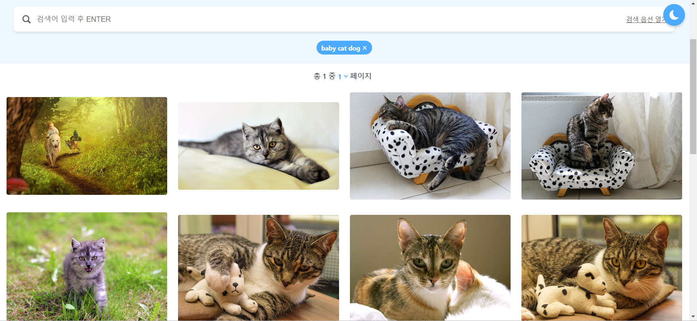

# wallpaper-search-engine

### Index

#### <a href="#introduce">Introduce</a>

#### <a href="#skill">Skill</a>

#### <a href="#build">Build</a>

#### <a href="#study">Study</a>

## <div id="introduce">Introduce</div>

 

wallpaper-search-engine은 [30개 프로젝트로 배우는 프론트엔드 웹 개발 (with React)의 수업 과제](https://github.com/hanameee/wallpaper-search-engine)로 pixabay의 이미지 API를 활용한 이미지 검색 기능을 제공하는 사이트입니다..

wallpaper-search-engine에서 구현한 기능들은 다음과 같습니다.

1.  검색어 입력 후 enter누르면 검색어에 맞춘 이미지를 보여줍니다. 키워드 사이의 띄어쓰기를 통해 여러개의 키워드를 이용한 검색도 가능합니다.

    📷 <**"baby cat dog"** 검색 시 화면>

    

2.  검색 옵션을 설정할 수 있고, 옵션이 변경 될 경우 이전에 검색한 결과들도 변경됩니다.
3.  이전에 검색한 검색어(이하 최신 검색어)를 클릭 시, 검색어 입력창에 반영됩니다.
4.  최신 검색어들은 저장되어 새로고침 시나 새로 창을 열었을 경우에도 남아있습니다.
5.  최신 검색어들은 옆의 "x"버튼을 클릭해 삭제할 수 있습니다.
6.  이미지를 클릭하면 이미지 상세보기 모달창이 열립니다.
7.  이미지 상세보기 모달창에서 이미지 로드가 완료되기 전까지는 로딩화면이 나타납니다. **(React의 Suspense 사용)**
8.  다크모드를 기능을 제공합니다.
9.  새로고침 시나 페이지를 처음 열때에는 최근 검색어가 있을 경우 해당 검색어를, 없을 경우에는 임의로 정한 "dog"를 검색어로 한 검색 결과가 화면에 나타납니다.

## <div id="skill">Skill</div>

-   HTML, CSS, Styled-components
-   React, Typescript

## <div id="build">Build</div>

### Install

```bash
 npm i
```

### Start

```bash
  npm run start
```

### Build

```
  npm run build
```

### Study : React- Suspense

React의 Suspense를 이번 프로젝트를 통해서 처음 적용해 봤습니다.

이번 프로젝트에서 이미지 상세보기 모달창을 열었을 때 이미지 로드가 완료되기까지 어느 정도의 시간이 필요하다는 문제가 있었고 로드되는 시간동안 로딩화면을 보여주고자 React의 Suspense를 사용했습니다.

Suspense는 비동기 데이터를 가져오는 동안 Suspense의 자식 요소의 렌더링을 중단하고 fallback에 설정한 컴포넌트를 보여주는 기능으로,
이미지를 비동기 데이터로 가져오는 컴포넌트가 필요했고 이런 기능을 제공하는 "react-image" 라이브러리를 이용해 SuspenseImage 컴포넌트를 만들었고
로딩화면은 Loading 컴포넌트를 통해 구현했습니다.
